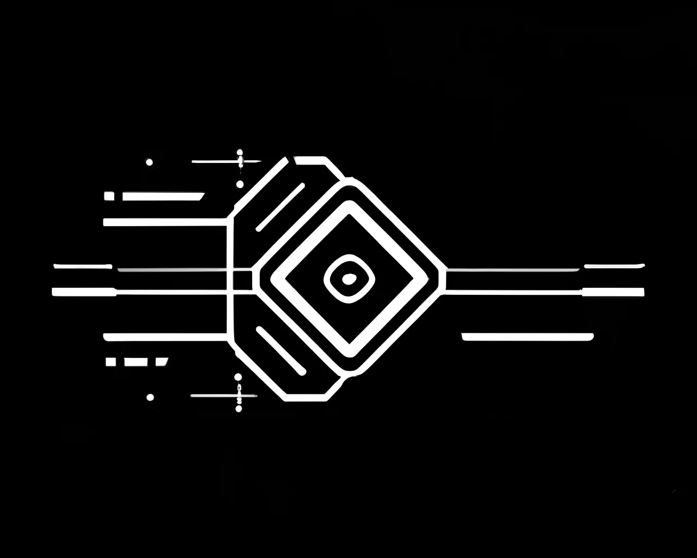

<div align="center">
  
  
  # Multiplexer
  
  [](https://opensource.org/licenses/MIT)
  [](https://github.com/BitFinding/multiplexer/actions/workflows/rust.yml)
  
  A flexible smart contract system for executing complex transaction sequences
</div>

> ⚠️ **WARNING**: This contract has not been audited. Using this contract with real assets could result in permanent loss of funds. Use at your own risk.

## 🚀 Quick Start

```bash
# Clone the repository
git clone https://github.com/BitFinding/multiplexer.git
cd multiplexer

# Install dependencies
cargo build

# Run tests
ETH_RPC_URL=http://192.168.1.249:8545 cargo test
```

A flexible smart contract system for executing complex transaction sequences, including flash loan operations. The system consists of a main executor contract that can process a series of actions encoded as bytecode instructions.

## Testing
```bash
$ ETH_RPC_URL=http://192.168.1.249:8545 cargo test
```

## Core Features

- Sequential execution of multiple operations in a single transaction
- Support for flash loans from multiple protocols (Morpho, Aave)
- Low-level operation support (calls, creates, delegate calls)
- Memory management for transaction data
- Fail-safe mechanisms with configurable error handling

## Operations

The contract supports the following operations, encoded as single-byte opcodes:

| Opcode | Operation    | Description                                      | Encoding Format                                                           |
|--------|-------------|--------------------------------------------------|--------------------------------------------------------------------------|
| 0x00   | EOF         | End of flow marker                               | `0x00`                                                                    |
| 0x01   | CLEARDATA   | Clear transaction data buffer                    | `0x01 + [size: uint16]`                                                  |
| 0x02   | SETDATA     | Set data at specific offset                     | `0x02 + [offset: uint16] + [size: uint16] + [ bytes]`              |
| 0x03   | SETADDR     | Set target address                              | `0x03 + [address: bytes20]`                                              |
| 0x04   | SETVALUE    | Set ETH value for calls                         | `0x04 + [value: uint256]`                                                |
| 0x05   | EXTCODECOPY | Copy external contract code                     | `0x05 + [addr: bytes20] + [dataOffset: uint16] + [codeOffset: uint16] + [size: uint16]` |
| 0x06   | CALL        | Perform external call                           | `0x06`                                                                    |
| 0x07   | CREATE      | Deploy new contract                             | `0x07`                                                                    |
| 0x08   | DELEGATECALL| Perform delegate call                           | `0x08`                                                                    |
| 0x09   | SETCALLBACK | Set callback address for flash loans           | `0x09 + [address: bytes20]`                                              |
| 0x0A   | SETFAIL     | Enable revert on call failure                   | `0x0A`                                                                    |
| 0x0B   | CLEARFAIL   | Disable revert on call failure                  | `0x0B`                                                                    |

## Memory Management

The contract maintains a dynamic bytes array (`txData`) as a working buffer for all operations:

- Memory Layout:
  - 0x00-0x20: Length of array (32 bytes)
  - 0x20-onwards: Actual data bytes

Operations that interact with this buffer:
- CLEARDATA: Clears and resizes the buffer
- SETDATA: Writes data at specific offsets
- EXTCODECOPY: Copies external contract code into the buffer
- CALL/DELEGATECALL/CREATE: Read from the buffer for execution

## Flash Loan Support

The contract implements callbacks for multiple flash loan protocols:

### Morpho Flash Loan
```solidity
function onMorphoFlashLoan(uint256 amount, bytes calldata data)
```

### Aave Flash Loan
```solidity
function executeOperation(
    address asset,
    uint256 amount,
    uint256 premium,
    address initiator,
    bytes calldata params
)
```

## Example Usage

Here's an example sequence that performs a contract call:

```text
0x01 0x0040          // CLEARDATA: Allocate 64 bytes
0x03 <target_addr>   // SETADDR: Set target contract
0x04 <eth_value>     // SETVALUE: Set ETH to send
0x02 0x0000 0x0004   // SETDATA: Set function selector
<4 bytes selector>   // Function selector bytes
0x0A                 // SETFAIL: Enable revert on failure
0x06                 // CALL: Execute the call
0x00                 // EOF: End sequence
```

## Security Considerations

- Owner-only access control
- Callback address validation for flash loans
- Automatic callback address clearing after use
- Optional failure handling with SETFAIL/CLEARFAIL
- Memory bounds checking for all operations

## Development

The contract is developed in Solidity and includes a comprehensive test suite written in Rust. The tests use Anvil for local blockchain simulation.

